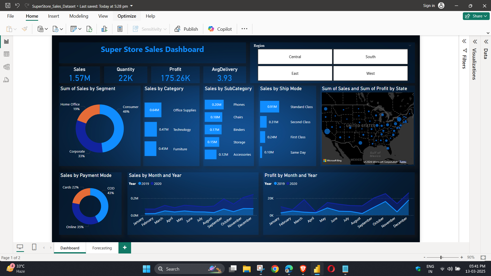

# 🛒 Super Store Sales Dashboard

A Data Analytics & Business Intelligence project developed using **Power BI**, **SQL**, and **Excel** to analyze Super Store sales data and generate meaningful business insights.

## 📌 Project Overview

This project focuses on analyzing retail sales data to identify sales trends, customer behavior, profit performance, and regional business performance. The dashboard provides interactive visualizations that help stakeholders make data-driven decisions.

---

## 📊 Dashboard Preview



---

## 🚀 Features

- Interactive Power BI Dashboard
- KPI Cards
  - Total Sales
  - Total Quantity Sold
  - Total Profit
  - Average Delivery Time
- Sales Analysis by
  - Segment
  - Category
  - Sub-Category
  - Ship Mode
  - Payment Mode
- State-wise Sales & Profit Map
- Monthly Sales Trend
- Monthly Profit Trend
- Region Filter (Central, East, South, West)

---

## 🛠️ Tools & Technologies

- Power BI
- Microsoft Excel
- SQL
- CSV Dataset

---

## 📂 Project Structure

```
SuperStore-Sales-Dashboard/
│
├── SuperStore_Sales_Dataset.pbix
├── SuperStore Sales DataSet.xlsx
├── SuperStore_Sales_Dataset.csv
├── _1.png
├── README.md
└── SQL/
    ├── Database.sql
    └── BusinessQueries.sql
```

---

## 📈 Key Insights

- Consumer segment contributes the highest sales.
- Office Supplies is the top-selling category.
- Phones generate the highest sales among sub-categories.
- Standard Class is the most preferred shipping mode.
- Cash on Delivery (COD) is the most used payment mode.
- Sales and profit increase significantly during the last quarter of the year.

---

## 📌 KPIs

| KPI | Value |
|------|-------|
| Total Sales | 1.57M |
| Total Quantity | 22K |
| Total Profit | 175.26K |
| Average Delivery | 3.93 Days |

---

## 📷 Dashboard Highlights

- Sales Performance Analysis
- Profit Analysis
- Customer Segment Analysis
- Geographic Sales Distribution
- Monthly Sales & Profit Trends
- Interactive Filters

---

## 📥 How to Use

1. Clone this repository.

```bash
git clone https://github.com/your-username/SuperStore-Sales-Dashboard.git
```

2. Open the `.pbix` file using Power BI Desktop.

3. Refresh the dataset if required.

4. Explore the dashboard using the Region slicer and visual filters.

---

## 🎯 Business Objectives

- Monitor sales performance.
- Track profitability.
- Identify high-performing products.
- Understand customer purchasing behavior.
- Support business decision-making with interactive dashboards.

---

## 👨‍💻 Author

**Hariharan**

Data Analytics & Business Intelligence Project

---

## ⭐ If you found this project useful, don't forget to Star this repository!
