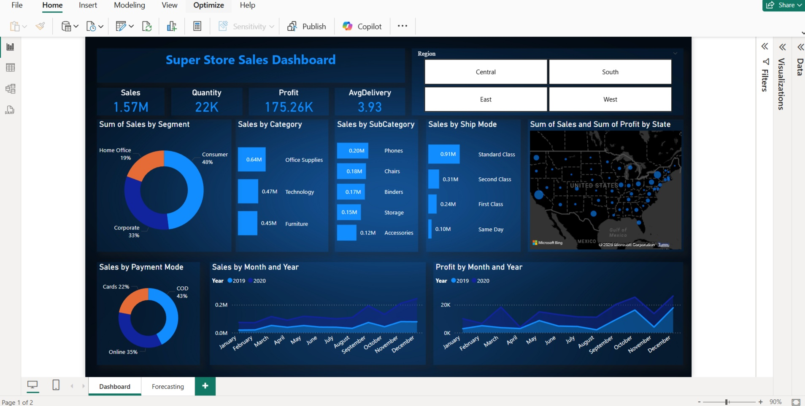

# 🛒 Super Store Sales Dashboard

A Data Analytics & Business Intelligence project developed using **Power BI**, **SQL**, and **Microsoft Excel** to analyze Super Store sales data and generate meaningful business insights through an interactive dashboard.

---

## 📌 Project Overview

The **Super Store Sales Dashboard** is designed to help businesses monitor sales performance, profit trends, customer segments, and regional performance. It provides interactive visualizations that enable users to explore sales data and make informed business decisions.

---

## 📊 Dashboard Preview



---

## 🚀 Features

- 📈 Interactive Power BI Dashboard
- 📊 KPI Cards
  - Total Sales
  - Total Quantity Sold
  - Total Profit
  - Average Delivery Time
- 👥 Sales Analysis by Customer Segment
- 🛍️ Sales Analysis by Category & Sub-Category
- 🚚 Sales Analysis by Ship Mode
- 💳 Sales Analysis by Payment Mode
- 🗺️ State-wise Sales & Profit Map
- 📅 Monthly Sales Trend Analysis
- 💹 Monthly Profit Trend Analysis
- 🌍 Region Filter (Central, East, South, West)

---

## 🛠️ Tools & Technologies

- Microsoft Power BI
- SQL
- Microsoft Excel
- CSV Dataset

---

## 📂 Project Structure

```
SuperStore-Sales-Dashboard/
│
├── dashboard.jpg
├── README.md
├── SuperStore_Sales_Dataset.pbix
├── SuperStore Sales DataSet.xlsx
├── SuperStore_Sales_Dataset.csv
└── SQL/
    ├── Database.sql
    └── BusinessQueries.sql
```

---

## 📈 Key Insights

- Consumer Segment contributes the highest sales.
- Office Supplies is the highest-selling product category.
- Phones generate the highest revenue among all sub-categories.
- Standard Class is the most preferred shipping mode.
- Cash on Delivery (COD) is the most frequently used payment method.
- Sales and profit show strong growth during the final quarter (October–December).

---

## 📌 Dashboard KPIs

| KPI | Value |
|------|-------|
| 💰 Total Sales | **1.57M** |
| 📦 Total Quantity | **22K** |
| 💵 Total Profit | **175.26K** |
| 🚚 Average Delivery Time | **3.93 Days** |

---

## 📷 Dashboard Highlights

- Sales Performance Overview
- Profit Analysis
- Customer Segment Distribution
- Category & Sub-Category Analysis
- Payment Mode Analysis
- Ship Mode Analysis
- State-wise Sales Visualization
- Monthly Sales & Profit Trends
- Interactive Region Filter

---

## 📥 How to Use

1. Clone this repository.

```bash
git clone https://github.com/your-username/SuperStore-Sales-Dashboard.git
```

2. Open **SuperStore_Sales_Dataset.pbix** using **Power BI Desktop**.

3. Refresh the dataset if required.

4. Explore the dashboard using the interactive slicers and filters.

---

## 🎯 Business Objectives

- Monitor overall sales performance.
- Analyze profitability across regions.
- Identify top-performing product categories.
- Understand customer purchasing behavior.
- Track monthly sales and profit trends.
- Support business decision-making through data visualization.

---

## 📚 Dataset

The dataset contains information related to:

- Orders
- Customers
- Products
- Sales
- Profit
- Quantity
- Ship Mode
- Payment Mode
- Region
- State
- Delivery Time

---

## 📌 Future Improvements

- Sales Forecasting
- Customer Lifetime Value (CLV) Analysis
- Product Recommendation Dashboard
- Inventory Analysis
- Advanced DAX Measures
- Real-time Data Integration

---

## 👨‍💻 Author

**Hariharan**

Data Analytics & Business Intelligence Project

---

## ⭐ Support

If you found this project useful, please consider **starring ⭐ this repository** and sharing your feedback.

Thank you for visiting!
